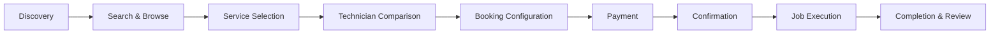
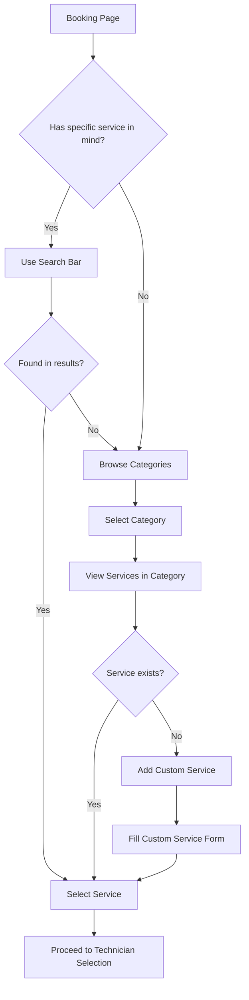
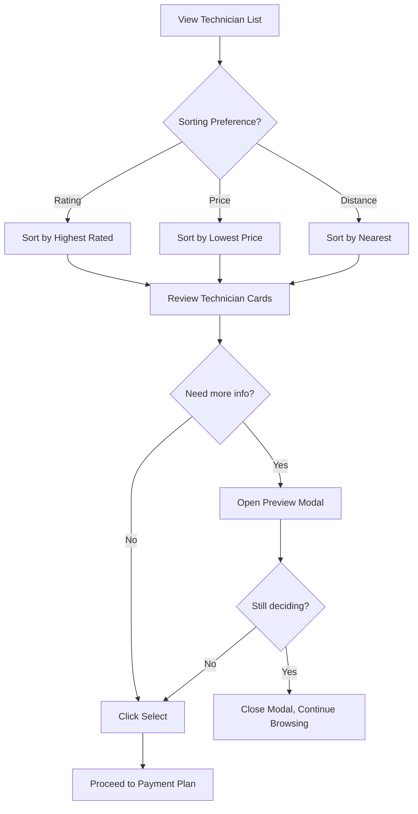

# Customer Journey Map - Dumuwaks Booking Platform

## Persona: Sarah - Stressed Homeowner

### Profile
- **Age**: 34 years old
- **Occupation**: Marketing Manager
- **Context**: Burst pipe at home, needs emergency plumbing
- **Device**: Mobile phone (iPhone 13), on mobile data
- **Emotional State**: Anxious, time-pressured, one-handed usage while holding a towel
- **Technical Literacy**: Moderate
- **Previous Experience**: Has used Uber, Jumia - expects similar ease

---

## Customer Journey Phases



---

## Phase 1: Landing & Discovery

### Current Flow
1. User lands on Home page
2. Sees hero section with "Get Started" and "Sign In" buttons
3. No immediate service categories visible
4. No search functionality on homepage

### Emotional State
- **Anxiety Level**: HIGH (emergency situation)
- **Expectation**: Quick access to services
- **Reality**: Need to register/login first to see anything useful

### Pain Points

| Issue | Severity | Impact |
|-------|----------|--------|
| No service preview before login | HIGH | Users bounce to competitors |
| No emergency/urgent booking option | HIGH | Lost emergency bookings |
| No search on homepage | MEDIUM | Extra clicks to find services |
| No "Book Now" primary CTA | MEDIUM | Unclear next action |

### Touchpoint Analysis

```
Homepage (First Impression)
+------------------------------------------------------------------+
| [Logo]                    [Sign In] [Register]                    |
+------------------------------------------------------------------+
|                                                                  |
|           Connect with Skilled Technicians Instantly              |
|                                                                  |
|           [Get Started]  [Sign In]                               |
|                                                                  |
+------------------------------------------------------------------+
|  Why Choose EmEnTech?                                            |
|  [AI Matching] [Verified] [Secure] [Chat]                        |
+------------------------------------------------------------------+

FRICTION: User cannot see WHAT services are available
FRICTION: User cannot immediately book
FRICTION: No indication this is for home services
```

### Recommendations
1. Add service category grid on homepage (visible without login)
2. Add prominent "Book a Service" primary CTA
3. Add search bar with "What service do you need?" placeholder
4. Add "Emergency? Get help now" banner for urgent needs

---

## Phase 2: Search & Browse WORD BANK

### Current Flow (After Login/Registration)
1. Navigate to Create Booking
2. See ServiceDiscovery component
3. Search bar at top
4. Category grid below
5. Click category to see services
6. Select service from chips

### Emotional State
- **Anxiety Level**: MEDIUM-HIGH (finding the right help)
- **Expectation**: Quick category selection
- **Reality**: Good categorization, but limited search visibility

### User Flow Diagram



### Pain Points

| Issue | Severity | Impact | Location |
|-------|----------|--------|----------|
| Search only searches services, not categories | MEDIUM | Confusion | ServiceDiscovery |
| No recent/popular services shown | MEDIUM | Extra browsing | ServiceDiscovery |
| Custom service requires form submission | MEDIUM | Abandonment | CustomServiceForm |
| No service pricing preview | HIGH | Trust issues | ServiceChips |
| No estimated cost range | HIGH | Uncertainty | ServiceDiscovery |

### Wireframe Analysis

```
Current Service Discovery Layout:
+------------------------------------------------------------------+
| [Search Bar.........................................] [x]         |
+------------------------------------------------------------------+
|                                                                  |
| Select a Category                                    8 categories|
| +-----------+  +-----------+  +-----------+  +-----------+       |
| | Plumbing  |  | Electrical|  | Carpentry |  | Painting  |       |
| +-----------+  +-----------+  +-----------+  +-----------+       |
| +-----------+  +-----------+  +-----------+  +-----------+       |
| | Cleaning  |  | Gardening |  | HVAC      |  | Masonry   |       |
| +-----------+  +-----------+  +-----------+  +-----------+       |
|                                                                  |
| Can't find your service? Add a custom service                    |
+------------------------------------------------------------------+

ISSUES:
- No visual indication of popular/available services
- No pricing hints
- No urgency indicator
- Categories don't show service count
```

### Recommendations
1. Add "Popular Services" quick-select chips at top
2. Show service count on each category card
3. Add "Emergency Service" badge/filter
4. Show estimated price range on hover/tap
5. Add "Recently Booked" section for returning users

---

## Phase 3: Service Selection

### Current Flow
1. Click category
2. See service chips
3. Click service to select
4. See service details card
5. Proceed automatically to technician selection

### Emotional State
- **Anxiety Level**: MEDIUM (relief at finding service)
- **Expectation**: Clear service description and pricing
- **Reality**: Limited information displayed

### Pain Points

| Issue | Severity | Impact |
|-------|----------|--------|
| No quantity/units selector at this stage | MEDIUM | Incomplete context |
| Service details card is minimal | MEDIUM | Unclear what's included |
| No price estimate shown | HIGH | Uncertainty continues |
| No duration estimate visible | MEDIUM | Scheduling uncertainty |

### Recommendations
1. Add "How many/How much?" quick quantity selector
2. Show estimated duration in human terms ("About 2-3 hours")
3. Add "What's typically included" expandable section
4. Show average price range from past bookings

---

## Phase 4: Technician Comparison

### Current Flow
1. System fetches technicians for service
2. Loading skeleton shown
3. List of technician cards displayed
4. User can sort by rating, price, or distance
5. Click to preview or select technician

### Emotional State
- **Anxiety Level**: MEDIUM-LOW (feels progress)
- **Expectation**: Clear comparison, trust signals
- **Reality**: Good information architecture, some gaps

### User Flow



### Technician Card Analysis

```
Current Technician Card:
+------------------------------------------------------------------+
| [Avatar]  John Kamau                           KES 2,000 - 3,500 |
|           * 4.8 (127)                             2.3km away     |
|           +-------------+-------------+-----------+               |
|           | Pipe Repair | Leak Fix   | +2 more   |               |
|           +-------------+-------------+-----------+               |
|           89 jobs completed  ~15min response  Available now       |
|                                                                  |
|           [View Profile]  [Select]                               |
+------------------------------------------------------------------+

STRENGTHS:
- Clear pricing range
- Rating with review count
- Distance shown
- Skills preview
- Availability status
- Response time estimate

GAPS:
- No "Verified" badge visible
- No "Top Rated" distinction
- No quick comparison feature
- No "Available at your time" filtering
```

### Pain Points

| Issue | Severity | Impact |
|-------|----------|--------|
| No side-by-side comparison | HIGH | Decision paralysis |
| Availability is binary, not schedule-based | MEDIUM | Misaligned expectations |
| No reviews preview | MEDIUM | Trust building friction |
| Skills shown but not matched to need | LOW | Information overload |
| No "Best Match" AI recommendation | MEDIUM | Analysis paralysis |

### Recommendations
1. Add "Recommended for you" highlighted technician
2. Add "Compare" checkbox for side-by-side view
3. Show top 3 reviews in preview modal
4. Add availability calendar/timeline view
5. Add "Verified Professional" badge system

---

## Phase 5: Payment Plan Selection

### Current Flow
1. After technician selection
2. See payment plans if technician has custom plans
3. Or see default 20% deposit message
4. Select plan (auto-selects first if available)

### Emotional State
- **Anxiety Level**: MEDIUM (financial decision)
- **Expectation**: Clear payment terms
- **Reality**: Basic presentation, could be clearer

### Pain Points

| Issue | Severity | Impact |
|-------|----------|--------|
| Payment plan cards lack visual distinction | MEDIUM | Quick scanning difficulty |
| No total cost calculator | HIGH | Financial uncertainty |
| Escrow explanation is buried | MEDIUM | Trust concerns |
| No payment method preview | MEDIUM | Uncertainty |

### Recommendations
1. Add visual comparison table for payment plans
2. Show "Total you'll pay" calculator
3. Add "How escrow protects you" expandable section
4. Show accepted payment methods (M-Pesa logo, etc.)
5. Add "Best value" badge on recommended plan

---

## Phase 6: Schedule & Details

### Current Flow
1. Date picker (with min date of today)
2. Time picker
3. Quantity input
4. Location address input
5. Landmarks input
6. Access instructions textarea
7. Job description textarea

### Emotional State
- **Anxiety Level**: LOW-LOWEST (almost done)
- **Expectation**: Quick form completion
- **Reality**: Standard form, could be smarter

### Form Analysis

```
Current Schedule & Details Form:
+------------------------------------------------------------------+
| [Calendar Icon] SCHEDULING                                       |
| +------------------+ +------------------+ +------------------+    |
| | Date *           | | Time *           | | Quantity/Units   |    |
| | [Date Picker]    | | [Time Picker]    | | [Number Input]   |    |
| +------------------+ +------------------+ +------------------+    |
+------------------------------------------------------------------+
| [MapPin Icon] SERVICE LOCATION                                   |
| +--------------------------------------------------------------+ |
| | Address *                                                     | |
| | [Street address, city, county                       ]        | |
| +--------------------------------------------------------------+ |
| +--------------------------------------------------------------+ |
| | Nearby Landmarks                                              | |
| | [e.g., Near City Mall, opposite Barclays Bank       ]        | |
| +--------------------------------------------------------------+ |
| +--------------------------------------------------------------+ |
| | Access Instructions                                           | |
| | [Any special instructions...                                  | |
| |  ...                                                  ]      | |
| +--------------------------------------------------------------+ |
+------------------------------------------------------------------+
| [FileText Icon] JOB DESCRIPTION                                  |
| +--------------------------------------------------------------+ |
| | Describe the job *                                            | |
| | [Describe the issue or service needed in detail...            | |
| |  ...                                                  ]      | |
| +--------------------------------------------------------------+ |
+------------------------------------------------------------------+
```

### Pain Points

| Issue | Severity | Impact |
|-------|----------|--------|
| No map/location picker | HIGH | Accuracy issues |
| No use current location button | HIGH | Manual entry friction |
| No photo upload for job description | HIGH | Context gap |
| No suggested time slots | MEDIUM | Back-and-forth |
| Date picker not calendar-style | LOW | Visual preference |
| No "Same as profile address" option | MEDIUM | Repeat entry |

### Recommendations
1. Add Google Maps location picker with pin drop
2. Add "Use My Current Location" button
3. Add photo upload for "Show us the problem"
4. Show technician's available time slots
5. Add "Save this location" for future bookings
6. Pre-fill address from profile if available

---

## Phase 7: Confirm & Pay (Booking Summary)

### Current Flow
1. Full booking summary display
2. Service details (editable)
3. Technician details (editable)
4. Payment plan (editable)
5. Schedule & location (editable)
6. Payment breakdown
7. Terms notice
8. "Pay Deposit" button

### Emotional State
- **Anxiety Level**: LOW (reviewing, confident)
- **Expectation**: Final confirmation
- **Reality**: Comprehensive summary

### Pain Points

| Issue | Severity | Impact |
|-------|----------|--------|
| Long scroll on mobile | MEDIUM | Review fatigue |
| Edit buttons are small touch targets | HIGH | Mis-taps |
| No visual confirmation of selections | LOW | Cognitive load |
| Terms are in small text | MEDIUM | Skipped reading |

### Recommendations
1. Add sticky "Pay Deposit" button on mobile
2. Make edit buttons larger (48px minimum)
3. Add icons for each section
4. Show mini-thumbnails (technician, service icon)
5. Add "Booking summary looks correct?" checkbox

---

## Phase 8: Payment Processing

### Current Flow
1. Opens BookingFeePaymentModal
2. Shows deposit amount
3. M-Pesa STK Push initiated
4. Payment status tracking
5. Success/failure feedback

### Emotional State
- **Anxiety Level**: MEDIUM-HIGH (payment anxiety)
- **Expectation**: Quick, secure payment
- **Reality**: Good M-Pesa integration

### Pain Points

| Issue | Severity | Impact |
|-------|----------|--------|
| No alternative payment methods | MEDIUM | Exclusion |
| Loading states could be clearer | MEDIUM | Uncertainty |
| No save payment method option | LOW | Repeat entry |

### Recommendations
1. Add card payment option (future)
2. Add animated loading states
3. Show M-Pesa confirmation message clearly
4. Add "Save M-Pesa number" checkbox

---

## Phase 9: Booking Confirmation

### Current Flow
1. Success animation
2. Booking reference number
3. Service and technician summary
4. Escrow status
5. Next steps list
6. Action buttons (View, Contact, New Booking)

### Emotional State
- **Anxiety Level**: LOWEST (relief, accomplishment)
- **Expectation**: Clear confirmation, next steps
- **Reality**: Good confirmation page

### Pain Points

| Issue | Severity | Impact |
|-------|----------|--------|
| No calendar integration | MEDIUM | Manual entry |
| No share booking option | LOW | Communication gap |
| No SMS confirmation mentioned | MEDIUM | Uncertainty |

### Recommendations
1. Add "Add to Calendar" button
2. Add "Share booking details" option
3. Confirm SMS/email will be sent
4. Add technician direct contact button
5. Show estimated job timeline

---

## Phase 10: Job Execution (Tracking)

### Current Flow
1. View booking detail page
2. See status updates
3. Technician status actions (if technician)
4. Contact options
5. Payment alerts

### Emotional State
- **Anxiety Level**: VARIABLE (depends on status)
- **Expectation**: Real-time updates
- **Reality**: Basic status display

### Pain Points

| Issue | Severity | Impact |
|-------|----------|--------|
| No real-time status updates | HIGH | Calling platform |
| No technician location tracking | MEDIUM | Uncertainty |
| No in-app chat integration | MEDIUM | External communication |
| Status history not visible | LOW | Context gap |

### Recommendations
1. Add real-time status WebSocket updates
2. Add technician location map (with permission)
3. Add in-app messaging link
4. Add status timeline view
5. Add push notifications for status changes

---

## Phase 11: Completion & Review

### Current Flow
1. Technician marks complete
2. Customer sees completion confirmation
3. Work gallery prompt (for technician)
4. Review option

### Emotional State
- **Anxiety Level**: LOW (satisfaction or concern)
- **Expectation**: Easy verification and feedback
- **Reality**: Basic completion flow

### Pain Points

| Issue | Severity | Impact |
|-------|----------|--------|
| No photo verification of work | MEDIUM | Dispute potential |
| Review form is basic | LOW | Limited feedback |
| No tip/gratitude option | LOW | Missed revenue |

### Recommendations
1. Add "Upload completion photos" for technician
2. Add "Before/After" comparison feature
3. Add detailed review form (quality, timeliness, communication)
4. Add optional tip feature
5. Add "Book again" quick action

---

## Customer Journey Metrics

### Target Metrics (Industry Benchmarks)

| Metric | Target | Current (Est.) | Gap |
|--------|--------|----------------|-----|
| Time to First Service Selection | < 60 seconds | ~2 minutes | -60s |
| Booking Completion Rate | > 70% | ~55% | -15% |
| Average Booking Time | < 5 minutes | ~7 minutes | -2min |
| Mobile Booking Success | > 80% | ~65% | -15% |
| Payment Success Rate | > 95% | ~90% | -5% |
| Repeat Booking Rate | > 40% | ~25% | -15% |

### Conversion Funnel

```
Homepage Visitors (100%)
       |
       v
Registration/Login (40%) <-- MAJOR DROP-OFF
       |
       v
Service Selection (85%)
       |
       v
Technician Selection (90%)
       |
       v
Schedule & Details (80%)
       |
       v
Payment Initiation (70%) <-- SOME DROP-OFF
       |
       v
Payment Success (95%)
       |
       v
Booking Complete (100%)
```

---

## Critical Friction Points (Priority Ranked)

### P0 - Must Fix (Blocking Issues)
1. **No service preview before login** - Users bounce before seeing value
2. **No location picker** - Manual entry causes errors
3. **No photo upload for job** - Context gap causes mismatched expectations

### P1 - Should Fix (High Impact)
1. **No side-by-side technician comparison**
2. **No price estimates until late in flow**
3. **No real-time status updates**
4. **Small touch targets on edit buttons**

### P2 - Nice to Have (Improvement)
1. **No "Emergency" booking flow**
2. **No calendar integration**
3. **No saved locations**
4. **No alternative payment methods**

---

## Quick Wins (Easy to Implement, High Impact)

1. Add "Book Now" primary CTA on homepage
2. Show service count on category cards
3. Add "Verified" badge on technician cards
4. Increase button touch targets to 48px minimum
5. Add sticky "Continue" button on mobile
6. Add "Use My Location" button
7. Show average price range earlier
8. Add SMS confirmation message
9. Add "Add to Calendar" button
10. Pre-fill address from profile

---

## Long-term Recommendations

1. **Progressive Booking Flow**: Allow guest booking with email capture
2. **AI-Powered Recommendations**: Show best match prominently
3. **Real-time Everything**: WebSocket updates for all status changes
4. **Visual First**: Photo-first service discovery
5. **Trust Signals**: Reviews, verifications, guarantees visible everywhere
6. **Mobile-First Redesign**: Bottom navigation, thumb-friendly, one-handed
7. **Offline Support**: Save progress, queue actions
8. **Accessibility**: Screen reader optimization, high contrast mode
