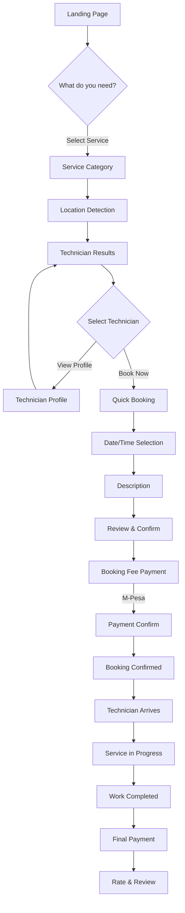
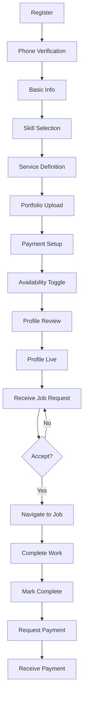

# Dumuwaks User Journey Maps

## Overview

This document maps the ideal user journeys for the Dumuwaks platform, optimized for mobile-first, action-based experiences in the Kenyan market context.

---

## Customer Journey: Service Discovery to Completion

### Journey Overview

```
Landing -> Service Discovery -> Technician Selection -> Booking -> Payment -> Service -> Completion
```

### Journey Metrics

| Metric | Target | Current (Est.) |
|--------|--------|----------------|
| Total Time | <10 min | 20+ min |
| Taps Required | 8-10 | 15+ |
| Success Rate | >85% | ~60% |
| Abandonment Points | 0 | 3+ |

### Detailed Journey Map



### Step-by-Step Journey

#### Phase 1: Discovery (Target: 30 seconds, 2 taps)

```
+------------------------------------------+
| DUMUWAKS                        [Menu]   |
+------------------------------------------+
|                                          |
|     What do you need fixed today?        |
|                                          |
|  +------------------------------------+  |
|  |  [Search services...]          Q]  |  |
|  +------------------------------------+  |
|                                          |
|  POPULAR SERVICES                        |
|                                          |
|  +--------+  +--------+  +--------+     |
|  | [IMG]  |  | [IMG]  |  | [IMG]  |     |
|  |PLUMBING|  |ELECTRIC|  | CLEAN- |     |
|  |        |  |  AL    |  |  ING   |     |
|  +--------+  +--------+  +--------+     |
|                                          |
|  +--------+  +--------+  +--------+     |
|  | [IMG]  |  | [IMG]  |  | [IMG]  |     |
|  |CARPENT-|  |PAINTING|  | APPLI- |     |
|  |  RY    |  |        |  | ANCE   |     |
|  +--------+  +--------+  +--------+     |
|                                          |
|  [+ VIEW ALL SERVICES]                   |
|                                          |
+------------------------------------------+
| [Home]  [Bookings]  [Messages]  [Profile]|
+------------------------------------------+

ACTIONS:
1. Tap service category -> Proceed to Phase 2
2. Search -> Type service name -> Proceed to Phase 2
```

**Success Criteria:**
- User finds desired service within 30 seconds
- Visual categories reduce cognitive load
- Search available for specific needs

**Edge Cases:**
- Service not found -> Suggest similar services
- User unsure -> "Help me choose" flow

---

#### Phase 2: Location & Timing (Target: 20 seconds, 2 taps)

```
+------------------------------------------+
| [<- Back]      PLUMBING                  |
+------------------------------------------+
|                                          |
|  Where do you need the technician?       |
|                                          |
|  +------------------------------------+  |
|  |  [CURRENT LOCATION]           GPS] |  |
|  +------------------------------------+  |
|                                          |
|  - OR -                                  |
|                                          |
|  Enter address:                          |
|  +------------------------------------+  |
|  | Westlands, Nairobi             |  |
|  +------------------------------------+  |
|                                          |
|  When do you need it?                    |
|                                          |
|  [NOW] [TODAY] [TOMORROW] [PICK DATE]   |
|                                          |
+------------------------------------------+
|                                          |
|  [FIND TECHNICIANS]                      |
|                                          |
+------------------------------------------+

ACTIONS:
1. Tap "Current Location" -> Auto-detect GPS
2. Tap time option -> Set preferred time
3. Tap "Find Technicians" -> Proceed to Phase 3
```

**Success Criteria:**
- GPS auto-detection works in 3 seconds
- Manual address entry as fallback
- Quick time selection (not calendar picker)

**Edge Cases:**
- GPS denied -> Manual address required
- Location not serviceable -> Notify user with alternatives

---

#### Phase 3: Technician Selection (Target: 60 seconds, 2-3 taps)

```
+------------------------------------------+
| [<- Back]   5 TECHNICIANS NEAR YOU       |
+------------------------------------------+
|                                          |
|  Sorted by: Match Quality        [Filter]|
|                                          |
|  +------------------------------------+  |
|  | [PHOTO] John Kamau            [95] |  |
|  |          Electrician                |  |
|  |          4.8 | 2.3 km | KES 500/hr  |  |
|  |                                    |  |
|  | "Specializes in residential..."    |  |
|  |                                    |  |
|  | [VIEW PROFILE]    [BOOK NOW]       |  |
|  +------------------------------------+  |
|                                          |
|  +------------------------------------+  |
|  | [PHOTO] Mary Wanjiru           [92] |  |
|  |          Plumber                    |  |
|  |          4.9 | 3.1 km | KES 450/hr  |  |
|  |                                    |  |
|  | "10 years experience in..."        |  |
|  |                                    |  |
|  | [VIEW PROFILE]    [BOOK NOW]       |  |
|  +------------------------------------+  |
|                                          |
|  [Load More...]                          |
|                                          |
+------------------------------------------+

ACTIONS:
1. Tap "View Profile" -> View full technician profile
2. Tap "Book Now" -> Proceed to Phase 4
3. Tap "Filter" -> Apply additional filters
```

**Success Criteria:**
- Technicians sorted by match quality
- Key info visible in card (rating, distance, price)
- One tap to book

**Edge Cases:**
- No technicians available -> Expand search radius or suggest alternatives
- User wants to compare -> Add to comparison feature

---

#### Phase 4: Quick Booking (Target: 90 seconds, 3 taps)

```
+------------------------------------------+
| [<- Back]     BOOK JOHN KAMAU            |
+------------------------------------------+
|                                          |
|  Step 1/2: What's the problem?           |
|                                          |
|  +------------------------------------+  |
|  | Describe your issue:               |  |
|  |                                    |  |
|  | My kitchen sink has been leaking   |  |
|  | for two days. The water is coming  |  |
|  | from under the cabinet.            |  |
|  |                                    |  |
|  +------------------------------------+  |
|                                          |
|  Add photos (optional):                  |
|  [+ Photo 1] [+ Photo 2] [+ Photo 3]    |
|                                          |
|  Urgency:                                |
|  [Emergency] [High] [Normal] [Low]      |
|                                          |
+------------------------------------------+
|                                          |
|  [NEXT: Review Booking ->]               |
|                                          |
+------------------------------------------+

ACTIONS:
1. Type description
2. Optionally add photos
3. Select urgency
4. Tap "Next" -> Proceed to confirmation
```

**Success Criteria:**
- Simple description field
- Photo upload for clarity
- Urgency selection affects pricing

---

#### Phase 5: Review & Payment (Target: 45 seconds, 2 taps)

```
+------------------------------------------+
| [<- Back]     REVIEW BOOKING             |
+------------------------------------------+
|                                          |
|  BOOKING SUMMARY                         |
|  +------------------------------------+  |
|  | Service:     Plumbing              |  |
|  | Technician:  John Kamau            |  |
|  | Date/Time:   Today, 2:00 PM        |  |
|  | Location:    Westlands, Nairobi    |  |
|  | Problem:     Kitchen sink leak     |  |
|  +------------------------------------+  |
|                                          |
|  PRICING                                 |
|  +------------------------------------+  |
|  | Estimated Service:  KES 1,500      |  |
|  | Booking Fee:        KES 200        |  |
|  | -----------------------------------|  |
|  | To Pay Now:         KES 200        |  |
|  +------------------------------------+  |
|                                          |
|  Payment Method:                         |
|  [X] M-Pesa  [ ] Card                    |
|                                          |
|  Phone: +254 7XX XXX XXX                 |
|                                          |
+------------------------------------------+
|                                          |
|  [CONFIRM & PAY KES 200]                 |
|                                          |
+------------------------------------------+

ACTIONS:
1. Review details
2. Confirm payment method
3. Tap "Confirm & Pay" -> M-Pesa prompt
```

**Success Criteria:**
- Clear pricing breakdown
- M-Pesa as primary payment
- One-tap confirmation

---

#### Phase 6: Confirmation & Tracking (Target: 10 seconds, 0 taps)

```
+------------------------------------------+
| [X]           BOOKING CONFIRMED!         |
+------------------------------------------+
|                                          |
|            [CHECKMARK ANIMATION]         |
|                                          |
|  Booking #BW-2024-1234                   |
|                                          |
|  John Kamau will arrive at               |
|  2:00 PM today                           |
|                                          |
|  +------------------------------------+  |
|  | TRACK YOUR TECHNICIAN              |  |
|  |                                    |  |
|  | [MAP SHOWING ROUTE]                |  |
|  |                                    |  |
|  | ETA: 25 minutes                    |  |
|  +------------------------------------+  |
|                                          |
|  [CALL]           [MESSAGE]              |
|                                          |
+------------------------------------------+
|                                          |
|  [VIEW ALL MY BOOKINGS]                  |
|                                          |
+------------------------------------------+

ACTIONS:
1. View tracking map
2. Call technician (if needed)
3. Message technician
4. View all bookings
```

**Success Criteria:**
- Clear confirmation
- Real-time tracking
- Easy communication options

---

#### Phase 7: Service & Completion (Target: Variable, 1 tap)

```
+------------------------------------------+
| [<- Back]    BOOKING IN PROGRESS         |
+------------------------------------------+
|                                          |
|  STATUS: Service in Progress             |
|                                          |
|  John Kamau                              |
|  Started at 2:05 PM                      |
|                                          |
|  [PHOTO OF WORK IN PROGRESS]             |
|                                          |
|  "Repairing the pipe under the sink"     |
|                                          |
|  Estimated completion: 3:00 PM           |
|                                          |
|  [MESSAGE TECHNICIAN]                    |
|                                          |
+------------------------------------------+

-- AFTER COMPLETION --

+------------------------------------------+
| [<- Back]    RATE YOUR EXPERIENCE        |
+------------------------------------------+
|                                          |
|  How was your experience with            |
|  John Kamau?                             |
|                                          |
|  [STAR] [STAR] [STAR] [STAR] [STAR]     |
|                                          |
|  What went well?                         |
|  [X] On time    [X] Quality work         |
|  [ ] Good communication                  |
|  [ ] Fair pricing                         |
|                                          |
|  Tell us more (optional):                |
|  +------------------------------------+  |
|  | Great work, fixed the issue fast   |  |
|  +------------------------------------+  |
|                                          |
|  [SUBMIT REVIEW]                         |
|                                          |
+------------------------------------------+
```

---

### Customer Journey Success Metrics

| Phase | Target Time | Target Taps | Success Indicator |
|-------|-------------|-------------|-------------------|
| 1. Discovery | 30 sec | 2 | Service selected |
| 2. Location | 20 sec | 2 | Location confirmed |
| 3. Selection | 60 sec | 2-3 | Technician chosen |
| 4. Booking | 90 sec | 3 | Details submitted |
| 5. Payment | 45 sec | 2 | Payment confirmed |
| 6. Tracking | 10 sec | 0 | Booking visible |
| 7. Completion | Variable | 1 | Review submitted |
| **TOTAL** | **<5 min** | **12** | **Job complete** |

---

## Technician Journey: Onboarding to Getting Paid

### Journey Overview

```
Registration -> Verification -> Profile Setup -> Service Definition ->
Payment Setup -> Availability -> Receiving Jobs -> Getting Paid
```

### Journey Metrics

| Metric | Target |
|--------|--------|
| Profile Completion Time | <15 min |
| Time to First Job | <24 hours |
| Payment Processing | <24 hours |

### Detailed Journey Map



### Step-by-Step Journey

#### Phase 1: Registration (Target: 2 min)

```
+------------------------------------------+
|           BECOME A TECHNICIAN            |
+------------------------------------------+
|                                          |
|  Join 500+ verified technicians on       |
|  Dumuwaks and grow your business         |
|                                          |
|  +------------------------------------+  |
|  | Phone Number                       |  |
|  | +254 | 7XX XXX XXX                 |  |
|  +------------------------------------+  |
|                                          |
|  +------------------------------------+  |
|  | Create Password                    |  |
|  +------------------------------------+  |
|                                          |
|  [CONTINUE WITH PHONE]                   |
|                                          |
|  - OR -                                  |
|                                          |
|  [Google] [Facebook]                     |
|                                          |
+------------------------------------------+

-- VERIFICATION --

+------------------------------------------+
|           VERIFY YOUR PHONE              |
+------------------------------------------+
|                                          |
|  We sent a code to +254 7XX XXX XXX     |
|                                          |
|  Enter the 6-digit code:                 |
|                                          |
|  +---+ +---+ +---+ +---+ +---+ +---+    |
|  | 4 | | 2 | | 8 | | 1 | | 6 | |   |    |
|  +---+ +---+ +---+ +---+ +---+ +---+    |
|                                          |
|  Didn't receive it? [Resend in 30s]     |
|                                          |
|  [VERIFY]                                |
|                                          |
+------------------------------------------+
```

---

#### Phase 2: Profile Setup (Target: 5 min)

```
+------------------------------------------+
|     STEP 1/4: BASIC INFORMATION          |
+------------------------------------------+
|                                          |
|  Progress: [====    ] 25%                |
|                                          |
|  +------------------------------------+  |
|  |     [UPLOAD PHOTO]                 |  |
|  |         [CAMERA ICON]              |  |
|  +------------------------------------+  |
|                                          |
|  First Name:                             |
|  +------------------------------------+  |
|  | John                              |  |
|  +------------------------------------+  |
|                                          |
|  Last Name:                              |
|  +------------------------------------+  |
|  | Kamau                             |  |
|  +------------------------------------+  |
|                                          |
|  What do you do? (Select all that apply) |
|                                          |
|  +--------+ +--------+ +--------+       |
|  |PLUMBING| |ELECTRIC| |CARPENT-|       |
|  |   [X]  | |   [ ]  | |   [ ]  |       |
|  +--------+ +--------+ +--------+       |
|                                          |
|  +--------+ +--------+ +--------+       |
|  |PAINTING| | CLEAN- | |  HVAC  |       |
|  |   [ ]  | |  ING   | |   [ ]  |       |
|  +--------+ +--------+ +--------+       |
|                                          |
+------------------------------------------+
|                                          |
|  [NEXT: Define Your Services ->]         |
|                                          |
+------------------------------------------+
```

---

#### Phase 3: Service Definition - WORD BANK Concept (Target: 5 min)

```
+------------------------------------------+
|     STEP 2/4: YOUR SERVICES              |
+------------------------------------------+
|                                          |
|  Progress: [======== ] 50%               |
|                                          |
|  What specific services do you offer?    |
|  Tap to select:                          |
|                                          |
|  PLUMBING SERVICES                       |
|  +--------+ +--------+ +--------+       |
|  |PIPE    | |TAP     | |DRAIN   |       |
|  |REPAIR  | |INSTALL | |CLEANING|       |
|  |  [X]   | |  [X]   | |  [ ]   |       |
|  +--------+ +--------+ +--------+       |
|                                          |
|  +--------+ +--------+ +--------+       |
|  |WATER   | |TOILET  | |BOILER  |       |
|  |TANK    | |REPAIR  | |SERVICE |       |
|  |  [ ]   | |  [ ]   | |  [ ]   |       |
|  +--------+ +--------+ +--------+       |
|                                          |
|  Don't see your service?                 |
|  [+ ADD CUSTOM SERVICE]                  |
|                                          |
|  YOUR SELECTED SERVICES:                 |
|                                          |
|  1. Pipe Repair                          |
|     Set your price:                      |
|     [X] Per Hour: KES [500]              |
|     [ ] Fixed: KES [    ]                |
|                                          |
|  2. Tap Installation                     |
|     Set your price:                      |
|     [X] Per Hour: KES [450]              |
|     [ ] Per Item: KES [800]              |
|                                          |
+------------------------------------------+
|                                          |
|  [NEXT: Build Your Portfolio ->]         |
|                                          |
+------------------------------------------+
```

**Key Feature: Custom Service Definition**
```
+------------------------------------------+
|     ADD CUSTOM SERVICE                   |
+------------------------------------------+
|                                          |
|  Service Name:                           |
|  +------------------------------------+  |
|  | Solar Panel Installation          |  |
|  +------------------------------------+  |
|                                          |
|  Category:                               |
|  [Electrical v]                          |
|                                          |
|  Description (what's included):          |
|  +------------------------------------+  |
|  | Full installation of solar        |  |
|  | panels including mounting,        |  |
|  | wiring, and inverter setup        |  |
|  +------------------------------------+  |
|                                          |
|  Pricing:                                |
|  [X] Per Hour  [ ] Fixed  [ ] Per Unit  |
|                                          |
|  Rate: KES [800]                         |
|                                          |
|  [SAVE SERVICE]                          |
|                                          |
+------------------------------------------+
```

---

#### Phase 4: Portfolio Upload (Target: 3 min)

```
+------------------------------------------+
|     STEP 3/4: SHOW YOUR WORK             |
+------------------------------------------+
|                                          |
|  Progress: [============] 75%            |
|                                          |
|  Upload photos of your best work         |
|  (Helps customers choose you!)           |
|                                          |
|  +--------+ +--------+ +--------+       |
|  | [IMG]  | | [IMG]  | | [IMG]  |       |
|  |   1    | |   2    | |   3    |       |
|  +--------+ +--------+ +--------+       |
|                                          |
|  +--------+ +--------+                   |
|  | [IMG]  | |  [+]   |                   |
|  |   4    | | ADD    |                   |
|  +--------+ +--------+                   |
|                                          |
|  BEFORE/A AFTER (Optional but powerful) |
|                                          |
|  +----------------+ +----------------+   |
|  |   BEFORE       | |    AFTER       |   |
|  |   [IMG]        | |    [IMG]       |   |
|  | Broken pipe    | | Fixed pipe     |   |
|  +----------------+ +----------------+   |
|                                          |
|  [+ ADD BEFORE/AFTER]                    |
|                                          |
+------------------------------------------+
|                                          |
|  [NEXT: Payment Setup ->]                |
|                                          |
+------------------------------------------+
```

---

#### Phase 5: Payment Setup (Target: 2 min)

```
+------------------------------------------+
|     STEP 4/4: GET PAID                   |
+------------------------------------------+
|                                          |
|  Progress: [===============] 100%        |
|                                          |
|  How would you like to receive payments? |
|                                          |
|  [X] M-Pesa                              |
|                                          |
|  M-Pesa Number:                          |
|  +------------------------------------+  |
|  | +254 | 7XX XXX XXX                 |  |
|  +------------------------------------+  |
|                                          |
|  Account Name (for verification):       |
|  +------------------------------------+  |
|  | JOHN KAMAU                        |  |
|  +------------------------------------+  |
|                                          |
|  Payment Schedule:                       |
|  [X] After each job completion           |
|  [ ] Weekly (every Monday)               |
|  [ ] Monthly (1st of each month)         |
|                                          |
|  [ ] Bank Account (optional)             |
|                                          |
+------------------------------------------+
|                                          |
|  [COMPLETE PROFILE]                      |
|                                          |
+------------------------------------------+
```

---

#### Phase 6: Availability & Going Live

```
+------------------------------------------+
|     PROFILE COMPLETE!                    |
+------------------------------------------+
|                                          |
|     [CELEBRATION ANIMATION]              |
|                                          |
|  Congratulations, John!                  |
|  Your profile is now under review.       |
|                                          |
|  While you wait (usually <24 hrs):       |
|                                          |
|  1. Turn on availability                 |
|                                          |
|  +------------------------------------+  |
|  | Available for Jobs          [===] |  |
|  +------------------------------------+  |
|                                          |
|  2. Set your service area                |
|                                          |
|  Maximum distance: 15 km                 |
|  [------------X----]                     |
|                                          |
|  3. Enable notifications                 |
|                                          |
|  [X] Push notifications                  |
|  [X] SMS alerts                          |
|  [ ] WhatsApp alerts                     |
|                                          |
+------------------------------------------+
|                                          |
|  [VIEW MY PROFILE]                       |
|                                          |
+------------------------------------------+
```

---

#### Phase 7: Receiving Jobs

```
+------------------------------------------+
|     NEW JOB REQUEST!                     |
+------------------------------------------+
|                                          |
|  [VIBRATION]                             |
|                                          |
|  +------------------------------------+  |
|  | PLUMBING - Kitchen Sink           |  |
|  |                                   |  |
|  | Mary Wanjiru                      |  |
|  | Westlands - 2.3 km away           |  |
|  |                                   |  |
|  | "My kitchen sink has been         |  |
|  |  leaking for two days..."         |  |
|  |                                   |  |
|  | [PHOTO OF SINK]                   |  |
|  |                                   |  |
|  | Estimated: KES 1,500              |  |
|  | Booking Fee: KES 200 (paid)       |  |
|  |                                   |  |
|  | Today at 2:00 PM                  |  |
|  |                                   |  |
|  +------------------------------------+  |
|                                          |
|  Expires in: 4:59                        |
|                                          |
|  [DECLINE]           [ACCEPT]            |
|                                          |
+------------------------------------------+
```

---

#### Phase 8: Job Completion & Payment

```
+------------------------------------------+
|     ACTIVE JOB                           |
+------------------------------------------+
|                                          |
|  JOB #BW-2024-1234                       |
|  Mary Wanjiru                            |
|                                          |
|  STATUS: In Progress                     |
|  Started: 2:05 PM                        |
|                                          |
|  +------------------------------------+  |
|  | [TAKE COMPLETION PHOTO]           |  |
|  +------------------------------------+  |
|                                          |
|  Before:                                 |
|  [PHOTO OF BROKEN PIPE]                  |
|                                          |
|  After:                                  |
|  [UPLOAD PHOTO]                          |
|                                          |
|  Work completed?                         |
|  [+ ADD NOTES ABOUT WORK]                |
|                                          |
+------------------------------------------+
|                                          |
|  [MARK COMPLETE & REQUEST PAYMENT]       |
|                                          |
+------------------------------------------+

-- AFTER MARKING COMPLETE --

+------------------------------------------+
|     PAYMENT REQUESTED                    |
+------------------------------------------+
|                                          |
|  [CHECKMARK]                             |
|                                          |
|  Payment request sent to Mary!           |
|                                          |
|  Amount: KES 1,500                       |
|                                          |
|  You'll receive payment via M-Pesa       |
|  within 24 hours of customer approval.   |
|                                          |
|  [VIEW ALL MY JOBS]                      |
|                                          |
+------------------------------------------+
```

---

### Technician Journey Success Metrics

| Phase | Target Time | Success Indicator |
|-------|-------------|-------------------|
| 1. Registration | 2 min | Account created |
| 2. Profile Setup | 5 min | Basic info complete |
| 3. Service Definition | 5 min | Services priced |
| 4. Portfolio | 3 min | Photos uploaded |
| 5. Payment Setup | 2 min | M-Pesa linked |
| **TOTAL** | **<20 min** | **Profile live** |

---

## Admin Journey: Platform Management

### Quick Reference Journey

```
Dashboard -> View Metrics -> Handle Alerts -> Review Applications ->
Resolve Disputes -> Generate Reports
```

### Dashboard Design

```
+---------------------------------------------------------------+
| DUMUWAKS ADMIN                              [Alerts] [Profile]|
+---------------------------------------------------------------+
|                                                               |
|  TODAY'S OVERVIEW                                             |
|  +------------+ +------------+ +------------+ +------------+  |
|  | BOOKINGS   | | ACTIVE     | | PENDING    | | REVENUE    |  |
|  |    47      | |    12      | |     8      | | KES 125K   |  |
|  | +15%       | | -3%        | | +22%       | | +8%        |  |
|  +------------+ +------------+ +------------+ +------------+  |
|                                                               |
|  ALERTS (3)                                                   |
|  +-----------------------------------------------------------+|
|  | [!] Dispute: Job #1234 - Customer claims incomplete work  ||
|  | [!] Verification pending: 5 technicians awaiting review   ||
|  | [!] Payment failed: Customer refund request               ||
|  +-----------------------------------------------------------+|
|                                                               |
|  PENDING VERIFICATIONS                                        |
|  +-----------------------------------------------------------+|
|  | [Photo] Peter Ochieng - Electrician - Submitted 2h ago    ||
|  | [Photo] Jane Muthoni - Plumber - Submitted 4h ago         ||
|  | [Photo] Ali Hassan - Carpenter - Submitted 1d ago         ||
|  |                                            [VIEW ALL >]   ||
|  +-----------------------------------------------------------+|
|                                                               |
+---------------------------------------------------------------+
```

---

## Cross-Journey Touchpoints

### Communication Channels

| Context | Customer | Technician |
|---------|----------|------------|
| Job Request | Push + SMS | Push + SMS |
| Confirmation | Push + SMS | Push + SMS |
| Reminders | Push + SMS | Push + SMS |
| Status Updates | Push | Push + SMS |
| Payment | Push + SMS | Push + SMS |
| Disputes | Email + In-App | Email + In-App |

### Offline Capabilities

| Feature | Customer Offline | Technician Offline |
|---------|------------------|-------------------|
| View Active Bookings | Yes (cached) | Yes (cached) |
| View Contact Info | Yes (cached) | Yes (cached) |
| Update Status | Queued | Queued |
| View Profile | Yes (cached) | Yes (cached) |
| Make Booking | No | N/A |

---

## Success Metrics Summary

### Customer Journey
- **Time to Book**: <5 minutes
- **Taps to Complete**: <15
- **Booking Completion Rate**: >85%
- **Customer Satisfaction**: >4.5/5

### Technician Journey
- **Profile Setup Time**: <20 minutes
- **Time to First Job**: <24 hours
- **Payment Processing Time**: <24 hours
- **Technician Satisfaction**: >4.5/5

### Platform Metrics
- **Monthly Active Users**: Track
- **Booking Success Rate**: >90%
- **Dispute Rate**: <5%
- **Revenue per Technician**: Track
