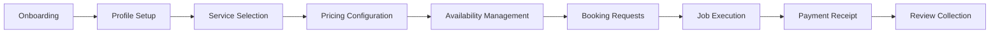
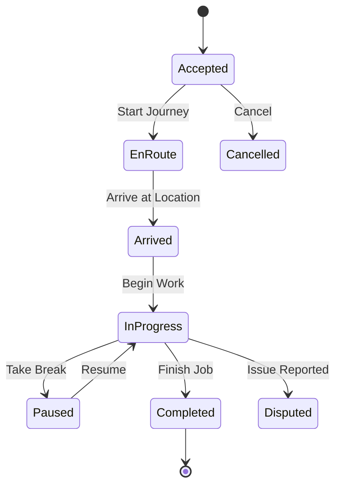

# Technician Journey Map - Dumuwaks Booking Platform

## Persona: James - Experienced Plumber

### Profile
- **Age**: 38 years old
- **Occupation**: Self-employed plumber with 8 years experience
- **Context**: Looking to grow business, tired of finding clients manually
- **Device**: Budget Android phone (Samsung A-series), inconsistent connectivity
- **Emotional State**: Hopeful but skeptical about new platforms
- **Technical Literacy**: Low-Moderate
- **Previous Experience**: Uses WhatsApp, Facebook Marketplace

---

## Technician Journey Phases



---

## Phase 1: Registration & Onboarding

### Current Flow
1. Sign up with email/phone
2. Select role (Technician)
3. Basic profile info
4. Redirected to dashboard

### Emotional State
- **Confidence**: LOW (new platform, unsure)
- **Expectation**: Quick setup, start earning
- **Reality**: Minimal guidance after registration

### Pain Points

| Issue | Severity | Impact |
|-------|----------|--------|
| No onboarding wizard | HIGH | Incomplete profiles |
| No "How it works" explanation | HIGH | Confusion |
| No earnings preview | MEDIUM | Low motivation |
| No success stories | MEDIUM | Trust issues |

### Wireframe Analysis

```
Current Registration Flow:
+------------------------------------------------------------------+
|                    Create an Account                              |
+------------------------------------------------------------------+
| First Name: [________________]                                   |
| Last Name:  [________________]                                   |
| Email:      [________________]                                   |
| Phone:      [________________]                                   |
| Password:   [________________]                                   |
| Role:       ( ) Customer  (*) Technician                         |
|                                                                  |
|                    [Create Account]                              |
+------------------------------------------------------------------+

MISSING:
- Progress indicator
- What happens next explanation
- Verification requirements list
- Estimated time to first booking
```

### Recommendations
1. Add 4-step onboarding wizard
2. Show "Average technicians earn KES X/week" preview
3. Add document upload requirements early
4. Add "What you'll need" checklist
5. Add video testimonials from successful technicians

---

## Phase 2: Profile Setup

### Current Flow (ProfileSettings.tsx)
1. Upload profile picture
2. Enter basic information
3. Add location with geocoding
4. Add skills (for technicians)
5. Set availability toggle
6. Manage services
7. Add work gallery

### Emotional State
- **Confidence**: MEDIUM (building presence)
- **Expectation**: Easy profile creation
- **Reality**: Comprehensive but lengthy form

### Profile Sections Analysis

```
Current Profile Settings Layout:
+------------------------------------------------------------------+
| [Settings Icon] Profile Settings                         [Cancel]|
+------------------------------------------------------------------+
|                                                                  |
| PROFILE PICTURE                                                  |
| +------------+                                                   |
| |   [Photo]  |  James Ochieng                                    |
| |            |  james@example.com                                |
| +------------+  Upload a new picture below (max 10MB)           |
| [Upload New Profile Picture]                                     |
|                                                                  |
+------------------------------------------------------------------+
| BASIC INFORMATION                                                |
| First Name: [____________] Last Name: [____________]            |
| Email: [james@example.com - disabled]                            |
| Phone: [+254__________]                                          |
| Bio:                                                             |
| [___________________________________________________]            |
| [___________________________________________________]            |
+------------------------------------------------------------------+
| LOCATION INFORMATION                                             |
| Address: [_________________________________]                     |
| City: [__________] *   County: [__________]                     |
| Country: [Kenya]                                                 |
| Coordinates: Longitude: 36.821945 | Latitude: -1.292066  [Set]  |
| [Get Coordinates from Address] [Use Current Location]           |
+------------------------------------------------------------------+
| AVAILABILITY STATUS                                              |
| Currently [Available/Unavailable]                                |
| [=============================] Toggle                           |
+------------------------------------------------------------------+
| SKILLS MANAGEMENT                                                |
| [+ Add Skill]                                                    |
| +------------+ +------------+ +------------+                     |
| | Plumbing   | | Pipe Fitting| | Bathroom  |                     |
| | 8 years    | | 6 years    | | 5 years   |                     |
| +------------+ +------------+ +------------+                     |
+------------------------------------------------------------------+
| MY SERVICES (WORD BANK)                                          |
| Select services you offer from our WORD BANK...                  |
| [+ Add Service]                                                  |
| +------------------+ +------------------+ +------------------+   |
| | Pipe Repair      | | Leak Detection   | | Toilet Install   |   |
| | KES 1,500-3,000  | | KES 2,000-4,000  | | KES 5,000-10,000 |   |
| +------------------+ +------------------+ +------------------+   |
+------------------------------------------------------------------+
| WORK GALLERY                                                     |
| Showcase your best work (0/10 images)                            |
| [+ Add Work Photo]                                               |
+------------------------------------------------------------------+
|                                          [Cancel] [Save Changes] |
+------------------------------------------------------------------+
```

### Pain Points

| Issue | Severity | Impact |
|-------|----------|--------|
| Form is overwhelming on mobile | HIGH | Abandonment |
| No progress indication | HIGH | No sense of completion |
| Location coordinates required | MEDIUM | Confusion |
| No profile completeness indicator | HIGH | Incomplete profiles |
| Skills form is separate modal | MEDIUM | Context switching |
| No preview of public profile | MEDIUM | Uncertainty |

### Recommendations
1. Add profile completeness progress bar (0% -> 100%)
2. Break into steps/wizard format
3. Add "See how others see you" preview
4. Auto-detect location by default
5. Add "Complete later" option for non-critical fields
6. Add gamification ("85% complete - Add work photos to reach 100%!")

---

## Phase 3: Service Selection (WORD BANK Integration)

### Current Flow
1. Click "Add Service" in My Services section
2. Modal opens with service selector
3. Browse categories and services
4. Set pricing for each service selected

### Emotional State
- **Confidence**: MEDIUM (defining offerings)
- **Expectation**: Quick selection from list
- **Reality**: Good categorization, pricing is manual

### Pain Points

| Issue | Severity | Impact |
|-------|----------|--------|
| No pricing guidance | HIGH | Under/over pricing |
| No competitor price comparison | MEDIUM | Market misalignment |
| No "popular services" suggestions | MEDIUM | Missed opportunities |
| Bulk pricing not supported | MEDIUM | Repetitive entry |

### Recommendations
1. Show "Average price: KES X-Y" for each service
2. Add "Most booked services in your area" suggestions
3. Allow bulk pricing (same price for multiple services)
4. Add pricing calculator with considerations

---

## Phase 4: Availability Management

### Current Flow
1. Simple toggle: Available / Unavailable
2. No schedule management
3. No calendar integration

### Emotional State
- **Confidence**: LOW (limited control)
- **Expectation**: Calendar-style availability
- **Reality**: Binary toggle only

### Pain Points

| Issue | Severity | Impact |
|-------|----------|--------|
| No weekly schedule | HIGH | Manual availability management |
| No time-block availability | HIGH | All-or-nothing availability |
| No calendar sync | MEDIUM | Double bookings |
| No vacation mode | MEDIUM | Penalty concerns |

### Recommendations
1. Add weekly availability calendar
2. Add time-slot availability (morning/afternoon/evening)
3. Add Google Calendar sync
4. Add "Vacation mode" with date range
5. Add "Maximum bookings per day" limit

---

## Phase 5: Receiving Booking Requests

### Current Flow
1. Booking appears in dashboard
2. Email/notification sent
3. View booking details
4. Accept/Decline options

### Emotional State
- **Confidence**: MEDIUM-HIGH (earning opportunity)
- **Expectation**: Quick review and decision
- **Reality**: Basic notification system

### Booking Request Card Analysis

```
Current Booking Request View:
+------------------------------------------------------------------+
| BOOKING #BK-2024-0127                           [Status Badge]   |
+------------------------------------------------------------------+
| Service Details                                                  |
| +--------------------------------------------------------------+ |
| | Service Category: Plumbing                                    | |
| | Description: Burst pipe under kitchen sink, water leaking...  | |
| | Urgency: High                                                 | |
| +--------------------------------------------------------------+ |
|                                                                  |
| Schedule                                                         |
| [Calendar] March 15, 2024                                        |
| [Clock] 10:00 AM - 12:00 PM                                      |
|                                                                  |
| Location                                                         |
| [MapPin] 123 Kenyatta Avenue, Westlands, Nairobi                |
|          Near Sarit Centre                                       |
|                                                                  |
| Pricing                                                          |
| Base Price: KES 3,500                                            |
| Platform Fee: KES 350                                            |
| Your Earnings: KES 3,150                                         |
|                                                                  |
| Customer                                                         |
| [Avatar] Sarah M.                                                |
|                                                                  |
| +--------------------------------------------------------------+ |
| |                    [Decline] [Accept]                         | |
| +--------------------------------------------------------------+ |
+------------------------------------------------------------------+
```

### Pain Points

| Issue | Severity | Impact |
|-------|----------|--------|
| No customer rating visible | HIGH | Unknown risk |
| No job photos provided | HIGH | Unclear scope |
| No counter-offer option | MEDIUM | Lost negotiations |
| No "tentative accept" option | MEDIUM | Commitment fear |
| Accept/Decline is binary | MEDIUM | No nuance |

### Recommendations
1. Show customer rating and review count
2. Allow job photo uploads in request
3. Add "Propose Alternative" option (time, price)
4. Add "Request More Info" button
5. Show distance and travel time estimate

---

## Phase 6: Job Execution

### Current Flow
1. View booking details
2. Update status through workflow:
   - Accepted -> En Route -> Arrived -> In Progress -> Completed
3. Contact customer
4. Complete job

### Status Workflow



### Pain Points

| Issue | Severity | Impact |
|-------|----------|--------|
| No navigation integration | HIGH | Manual address lookup |
| No in-app calling | MEDIUM | Phone number exposure |
| No photo documentation | HIGH | No proof of work |
| No material cost logging | MEDIUM | Incomplete billing |
| Paused status unclear | LOW | Status confusion |

### Recommendations
1. Add "Navigate to Location" (Google Maps integration)
2. Add in-app calling with number masking
3. Add before/during/after photo capture
4. Add material cost addition flow
5. Add "Add Notes" for each status change

---

## Phase 7: Payment Receipt

### Current Flow
1. Job marked complete
2. Escrow release initiated
3. Payment processed to M-Pesa
4. Transaction recorded

### Emotional State
- **Confidence**: HIGH (earning achieved)
- **Expectation**: Fast, transparent payment
- **Reality**: Escrow-based, some delay

### Pain Points

| Issue | Severity | Impact |
|-------|----------|--------|
| No payment timeline | HIGH | Anxiety |
| No earnings dashboard | MEDIUM | No progress tracking |
| No withdrawal control | MEDIUM | Passive |
| No payment history | MEDIUM | Record keeping |

### Recommendations
1. Show clear payment timeline ("Payment in 24-48 hours")
2. Add earnings dashboard with trends
3. Add withdrawal request option
4. Add detailed payment history
5. Add instant payout option (with small fee)

---

## Phase 8: Review Collection

### Current Flow
1. Customer prompted to review
2. Review appears on profile
3. Rating affects average

### Emotional State
- **Confidence**: VARIABLE (depends on rating)
- **Expectation**: Fair feedback
- **Reality**: Basic review system

### Pain Points

| Issue | Severity | Impact |
|-------|----------|--------|
| No response to reviews | MEDIUM | No voice |
| No review request system | LOW | Passive collection |
| No rating breakdown | MEDIUM | Unclear issues |
| Negative reviews are final | HIGH | No recourse |

### Recommendations
1. Add "Respond to Review" feature
2. Add gentle review reminders to customers
3. Show rating breakdown (quality, timeliness, communication)
4. Add "Report Review" for unfair reviews
5. Add "Review Resolution" process

---

## Technician-Specific Friction Points

### P0 - Must Fix (Blocking Earnings)

| Issue | Impact | Solution |
|-------|--------|----------|
| No weekly availability calendar | Can't manage schedule | Add calendar UI |
| No navigation to job | Manual address lookup | Integrate Google Maps |
| No work photos | Disputes, trust issues | Add photo capture flow |

### P1 - Should Fix (Impacts Experience)

| Issue | Impact | Solution |
|-------|--------|----------|
| No pricing guidance | Under/over pricing | Show market rates |
| No customer rating visible | Unknown risk | Show customer history |
| No earnings dashboard | No motivation tracking | Add dashboard widget |

### P2 - Nice to Have (Enhancement)

| Issue | Impact | Solution |
|-------|--------|----------|
| No calendar sync | Double bookings | Google Calendar API |
| No review response | One-sided feedback | Add response feature |
| No instant payout | Cash flow delays | Add instant option |

---

## Technician Journey Metrics

### Target Metrics

| Metric | Target | Current (Est.) |
|--------|--------|----------------|
| Profile Completion Rate | > 90% | ~60% |
| Services Added per Technician | > 3 | ~1.5 |
| Response Time to Requests | < 1 hour | ~3 hours |
| Booking Acceptance Rate | > 70% | ~55% |
| Job Completion Rate | > 95% | ~90% |
| Average Rating | > 4.5 | ~4.2 |
| Repeat Customer Rate | > 30% | ~20% |

### Technician Conversion Funnel

```
Registered Technicians (100%)
       |
       v
Profile Completed (60%) <-- DROP-OFF
       |
       v
Services Added (70%)
       |
       v
First Booking Received (50%)
       |
       v
First Booking Accepted (80%)
       |
       v
First Job Completed (90%)
       |
       v
Active After 30 Days (40%) <-- CHURN
```

---

## Quick Wins for Technicians

1. Add "Complete Profile" progress bar
2. Show market pricing for services
3. Add "Navigate" button with Google Maps
4. Show customer rating on booking request
5. Add photo capture for job documentation
6. Add "Vacation Mode" toggle
7. Add daily earning summary notification
8. Add quick "Available Today" toggle
9. Show "Jobs Near You" suggestions
10. Add in-app messaging link

---

## Long-term Technician Improvements

1. **Mobile-First App**: Native app with offline support
2. **Smart Scheduling**: AI-optimized job routing
3. **Earnings Dashboard**: Comprehensive analytics
4. **Customer CRM**: Notes, preferences, history
5. **Marketing Tools**: Profile badges, promotions
6. **Training Content**: Skill improvement resources
7. **Community Features**: Technician forums, tips
8. **Insurance Integration**: Liability coverage options
