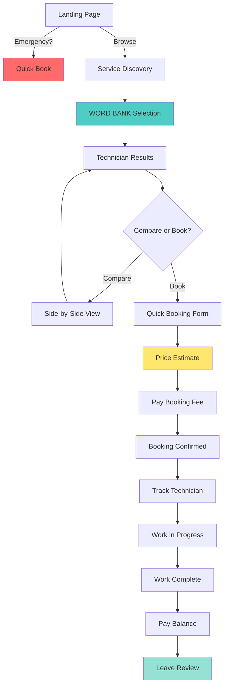
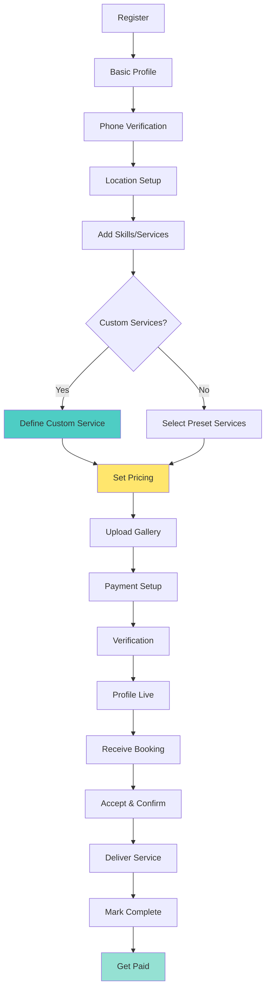

# User Journey Maps
## Dumuwaks Service Marketplace

---

## Table of Contents

1. [Customer Journey: End-to-End Service Booking](#journey-1-customer-complete-booking-experience)
2. [Technician Journey: Onboarding to First Payment](#journey-2-technician-onboarding-to-first-payment)
3. [Admin Journey: Daily Operations Monitoring](#journey-3-admin-daily-operations)

---

## Journey 1: Customer - Complete Booking Experience

### Journey Overview

**Persona:** Wanjiku the Homeowner
**Scenario:** Emergency - leaking kitchen pipe
**Goal:** Find a plumber, book them, get the leak fixed, pay, and review
**Target Time:** Under 30 minutes from discovery to booking

### Journey Stages

```
Discovery --> Selection --> Booking --> Service --> Payment --> Review
```

### Stage 1: Discovery (Target: 3 minutes)

**Current State Flow:**
```
Landing Page --> Register/Login --> Dashboard --> Find Technicians -->
Select Category (Plumbing) --> Set Location --> Search --> View Results
```

**Pain Points:**
- Must register/login before seeing anything
- Multiple clicks to reach technician search
- Category selection is text-based dropdown
- Cannot search without selecting category first

**Emotional Journey:**
```
[Anxious] --> [Confused] --> [Frustrated] --> [Relieved when results appear]
```

**Optimization Opportunities:**
1. Allow browsing technicians without login (view-only mode)
2. Visual service category selection (icons + images)
3. Auto-detect location
4. "Emergency" quick-access button on homepage

---

### Stage 2: Selection (Target: 5 minutes)

**Current State Flow:**
```
View Matched Technicians --> Sort/Filter --> View Profile --> Check Gallery -->
Check Reviews --> Compare with Others --> Decide
```

**Pain Points:**
- Match score is a number (92/100) - not intuitive
- Profile is information-heavy, not action-focused
- Gallery limited to 5 images
- Cannot compare technicians side-by-side
- Contact info hidden until booking

**Decision Factors (in order of importance):**
1. Proximity (how fast can they arrive?)
2. Rating (what do others say?)
3. Gallery (proof of quality work)
4. Price (is it affordable?)
5. Availability (are they free now?)

**Optimization Opportunities:**
1. Show "Can arrive in 30 min" badge prominently
2. Visual rating display (stars + review count)
3. Expandable gallery with "See more work"
4. Quick comparison cards
5. "Starting from KES X" price indicator

---

### Stage 3: Booking (Target: 5 minutes)

**Current State Flow:**
```
Click "Book" --> Fill Service Type --> Select Category (again!) -->
Describe Problem --> Set Date/Time --> Set Location --> Add Landmarks -->
Review Price Estimate --> Confirm --> Pay Booking Fee (M-Pesa Modal) -->
Booking Created
```

**Pain Points:**
- Category selection repeated
- Long form with many fields
- Service type selector is text-based
- Price estimate loads slowly
- Payment modal blocks everything
- No option to save draft

**Form Fields Analysis:**
| Field | Necessary? | Pain Level |
|-------|------------|------------|
| Service Category | Pre-filled from search | Low |
| Service Type | Could be visual selection | Medium |
| Description | Essential, but allow photo | High |
| Date/Time | Essential | Low |
| Location | Auto-detect if possible | Medium |
| Landmarks | Optional, nice to have | Low |
| Access Instructions | Optional | Low |

**Optimization Opportunities:**
1. Pre-fill everything possible from previous steps
2. Replace text selection with visual service picker (WORD BANK)
3. Allow photo upload instead of long description
4. One-tap "Emergency Now" vs "Schedule Later"
5. Show price estimate in real-time
6. Save draft automatically

---

### Stage 4: Service Delivery (Target: 1-4 hours)

**Current State Flow:**
```
Booking Confirmed --> Wait for Technician Response --> Receive Confirmation -->
Track Technician (if available) --> Technician Arrives --> Work Performed -->
Work Completed
```

**Pain Points:**
- No real-time tracking of technician
- Cannot communicate before arrival (unless booking active)
- No photo documentation of work done
- No approval step before marking complete

**Communication Needs:**
- "I am on my way" - with ETA
- "I have arrived"
- "I need to buy parts" - with cost update
- "Work complete" - with photos

**Optimization Opportunities:**
1. Real-time technician location (with permission)
2. In-app messaging from booking confirmation
3. Photo documentation of before/after
4. Customer approval before completion

---

### Stage 5: Payment (Target: 2 minutes)

**Current State Flow:**
```
Work Completed --> Review Final Amount --> Confirm --> Pay Balance -->
Receive Receipt --> Rate Technician
```

**Pain Points:**
- Final amount may differ from estimate (surprise!)
- Limited payment options
- No payment breakdown visible
- No digital receipt storage

**Optimization Opportunities:**
1. Show estimate vs final side-by-side
2. Explain any differences
3. One-tap M-Pesa payment
4. Downloadable receipt
5. Automatic expense tracking for user

---

### Stage 6: Review (Target: 1 minute)

**Current State Flow:**
```
Receive Prompt to Review --> Rate 1-5 Stars --> Write Review --> Submit
```

**Pain Points:**
- Generic review prompt
- Writing reviews is effort
- Cannot add photos to review
- No incentive to review

**Optimization Opportunities:**
1. Quick rating with preset tags
2. Photo upload for review
3. Review template suggestions
4. Small incentive (discount on next booking)

---

### Complete Journey Flow Diagram



---

### Journey Metrics

| Stage | Current Time | Target Time | Improvement |
|-------|--------------|-------------|-------------|
| Discovery | 5+ minutes | 2 minutes | 60% faster |
| Selection | 8+ minutes | 4 minutes | 50% faster |
| Booking | 7+ minutes | 3 minutes | 57% faster |
| Service | Variable | Transparent | N/A |
| Payment | 3+ minutes | 1 minute | 67% faster |
| Review | 2+ minutes | 30 seconds | 75% faster |
| **Total** | **25+ minutes** | **10.5 minutes** | **58% faster** |

---

## Journey 2: Technician - Onboarding to First Payment

### Journey Overview

**Persona:** Kamau the Plumber
**Scenario:** New technician joining the platform
**Goal:** Complete profile, get first booking, deliver service, receive payment
**Target Time:** 1 day to profile completion, 1 week to first payment

### Journey Stages

```
Registration --> Profile Setup --> Service Definition --> Payment Setup -->
Verification --> Profile Live --> First Booking --> Service Delivery --> Payment Received
```

---

### Stage 1: Registration (Target: 3 minutes)

**Current State Flow:**
```
Landing Page --> Sign Up as Technician --> Email/Phone Verification -->
Basic Info Form --> Password Set --> Account Created
```

**Pain Points:**
- Email verification requires checking email (extra step)
- Form asks for too much information upfront
- No progress indication
- Cannot save and continue later

**Optimization Opportunities:**
1. Phone-first registration (M-Pesa number as ID)
2. OTP via SMS (faster than email)
3. Minimal info to start (name, phone, location)
4. Clear progress bar
5. Auto-save after each field

---

### Stage 2: Profile Setup (Target: 10 minutes)

**Current State Flow:**
```
Profile Settings Page --> Upload Photo --> Fill Bio --> Set Location -->
Get Coordinates --> Set Availability --> Add Skills (dropdown) -->
Set Hourly Rate --> Save
```

**Pain Points:**
- Location coordinates require manual "Get Coordinates" button
- Skills are predefined categories only
- Cannot add custom skills
- Bio feels mandatory (anxiety about writing)
- Many tabs/sections to navigate

**Optimization Opportunities:**
1. Auto-detect location (ask permission once)
2. Skills as visual tags with "Add Custom" option
3. Bio suggestions/examples
4. Single-page progressive form
5. "Skip for now" on non-essential fields

---

### Stage 3: Service Definition (Target: 15 minutes)

**Current State Flow:**
```
[NOT AVAILABLE] - Current system uses predefined service categories only
```

**This is a critical gap.** Technicians cannot currently define their own services.

**Proposed Flow:**
```
Service Setup Page --> See Suggested Services (based on skills) -->
Select Applicable Services --> Add Custom Services --> Set Pricing for Each -->
Upload Service Photos --> Save
```

**Service Definition Elements:**
1. Service name (preset or custom)
2. Base price or price range
3. Unit (per job, per hour, per unit)
4. Description (optional)
5. Photos/examples (highly encouraged)

**Optimization Opportunities:**
1. Suggest common services based on skills
2. Easy "Clone and Modify" for similar services
3. Bulk pricing setup
4. Photo templates/guidelines

---

### Stage 4: Payment Setup (Target: 5 minutes)

**Current State Flow:**
```
[UNCLEAR] - Payment details setup not visible in current UI
```

**Proposed Flow:**
```
Payment Settings Page --> Enter M-Pesa Number --> Verify with OTP -->
Set Payment Preference (immediate/weekly) --> Add Bank Details (optional) -->
Save
```

**Payment Options Needed:**
1. M-Pesa (primary, essential)
2. Bank transfer (for larger amounts)
3. Payment schedule preferences

**Optimization Opportunities:**
1. M-Pesa verification via STK push
2. Clear explanation of payment timeline
3. Earnings calculator

---

### Stage 5: Verification (Target: 1-3 days)

**Current State Flow:**
```
[UNCLEAR] - Verification process not clearly visible
```

**Proposed Flow:**
```
Verification Page --> Upload ID (front/back) --> Take Selfie -->
Optional: Upload Certificates --> Submit --> Wait for Review --> Approved
```

**Verification Elements:**
1. National ID or Passport
2. Selfie for face matching
3. Trade certificates (optional but encouraged)
4. Business license (optional)

**Optimization Opportunities:**
1. In-app camera capture (no gallery upload needed)
2. Auto-detection of ID type
3. Clear status updates
4. "Verification in progress" badge on profile

---

### Stage 6: Work Gallery Setup (Target: 10 minutes)

**Current State Flow:**
```
Profile Settings --> Work Gallery Section --> Add Image --> Upload Photo -->
Fill Caption, Category, Date, Location --> Mark as Before/After --> Save
```

**Pain Points:**
- Limited to 5 images (major complaint)
- Many fields to fill per image
- Before/After pairing is complex
- No bulk upload

**Optimization Opportunities:**
1. Increase limit to 10-20 images (subscription tiers)
2. Simplified upload (photo + category only)
3. Drag-and-drop reordering
4. Bulk upload with batch tagging
5. Before/After slider component

---

### Stage 7: First Booking (Target: Within 1 week)

**Current State Flow:**
```
Wait for Match --> Receive Notification --> View Booking Details -->
Accept/Reject --> Confirm Arrival Time --> Travel to Location
```

**Pain Points:**
- Passive waiting (no control over visibility)
- Cannot proactively reach customers
- Booking details may be incomplete
- No deposit guarantee

**Optimization Opportunities:**
1. "Boost Profile" feature (for Pro subscribers)
2. Proactive bidding on posted jobs
3. Booking deposit held in escrow
4. Clear job requirements before accepting

---

### Stage 8: Service Delivery (Target: As agreed)

**Current State Flow:**
```
[UNCLEAR] - Limited tracking of service delivery
```

**Proposed Flow:**
```
Arrive at Location --> Mark "Arrived" --> Assess Work --> Update Price if Needed -->
Customer Approves --> Perform Work --> Mark "In Progress" --> Take Before Photo -->
Complete Work --> Take After Photo --> Mark "Complete" --> Wait for Customer Approval
```

**Service Delivery Checkpoints:**
1. Arrived
2. Assessing
3. Quote confirmed
4. In progress
5. Work complete
6. Customer approved

**Optimization Opportunities:**
1. Photo documentation required at each stage
2. Price change requires customer approval
3. Checklist for common services
4. Timer tracking for hourly work

---

### Stage 9: Payment Received (Target: Within 24-48 hours)

**Current State Flow:**
```
[UNCLEAR] - Payment processing not visible
```

**Proposed Flow:**
```
Customer Pays --> Funds in Escrow --> Work Approved --> Release to Technician -->
M-Pesa Notification --> View in Earnings Dashboard --> Withdraw or Auto-Transfer
```

**Payment Timeline:**
- Booking fee: Released immediately upon acceptance
- Balance: Released upon customer approval
- Disputed: Held until resolution

**Optimization Opportunities:**
1. Real-time earnings dashboard
2. Instant withdrawal option (small fee)
3. Weekly automatic transfer (free)
4. Payment history export

---

### Complete Technician Journey Flow Diagram



---

### Technician Journey Metrics

| Stage | Current Time | Target Time | Improvement |
|-------|--------------|-------------|-------------|
| Registration | 10+ minutes | 3 minutes | 70% faster |
| Profile Setup | 20+ minutes | 8 minutes | 60% faster |
| Service Definition | N/A (not available) | 10 minutes | New feature |
| Payment Setup | Unclear | 3 minutes | Clarified |
| Verification | 3-7 days | 1-2 days | 50% faster |
| Gallery Setup | 15+ minutes | 8 minutes | 47% faster |
| First Booking | Passive waiting | Proactive + 1 week | Active |
| Payment | Unclear | 24-48 hours | Transparent |

---

## Journey 3: Admin - Daily Operations

### Journey Overview

**Persona:** Atieno the Operations Manager
**Scenario:** Daily monitoring and issue resolution
**Goal:** Maintain platform health, resolve issues, ensure quality
**Context:** Office-based, desktop-first

### Daily Operations Checklist

```
Morning Review --> Monitor Dashboard --> Handle Flags --> Resolve Disputes -->
Approve Verifications --> Generate Reports --> End-of-Day Summary
```

---

### Stage 1: Morning Review (Target: 15 minutes)

**Current State:**
- Multiple dashboards to check (Admin, Reports, Support)
- No unified view
- Data scattered

**Desired Dashboard Widgets:**
1. Today's bookings (count + trend)
2. Active issues (count + urgency)
3. Pending verifications
4. Revenue today
5. Platform health score
6. Recent reviews (flagged ones highlighted)

**Optimization:**
1. Single unified dashboard
2. Traffic light indicators (green/yellow/red)
3. Drill-down capability
4. Customizable layout

---

### Stage 2: Issue Monitoring (Ongoing)

**Issue Types to Monitor:**
1. Unresponsive technicians
2. Disputed bookings
3. Payment failures
4. Customer complaints
5. Suspicious activity

**Current Gaps:**
- No real-time alerts
- Manual checking required
- Limited fraud detection

**Optimization:**
1. Real-time alert system
2. Automatic flagging rules
3. Priority queue
4. One-click resolution for common issues

---

### Stage 3: Verification Approval (As needed)

**Current Process:**
- View submitted documents
- Manually verify information
- Approve or reject
- Send notification

**Optimization:**
1. Side-by-side document comparison
2. Face match confidence score
3. Batch approval for clear cases
4. Template rejection reasons

---

## Journey Pain Points Summary

### Customer Journey Pain Points (Ranked by Impact)

| Rank | Pain Point | Stage | Impact | Solution Priority |
|------|------------|-------|--------|-------------------|
| 1 | Long booking form | Booking | HIGH | P0 - Critical |
| 2 | Text-based service discovery | Discovery | HIGH | P0 - Critical |
| 3 | Limited gallery (5 photos) | Selection | MEDIUM | P1 - High |
| 4 | No real-time tracking | Service | MEDIUM | P1 - High |
| 5 | Surprise pricing | Payment | MEDIUM | P2 - Medium |

### Technician Journey Pain Points (Ranked by Impact)

| Rank | Pain Point | Stage | Impact | Solution Priority |
|------|------------|-------|--------|-------------------|
| 1 | Cannot add custom services | Service Definition | HIGH | P0 - Critical |
| 2 | Limited gallery (5 photos) | Gallery Setup | HIGH | P0 - Critical |
| 3 | Long profile setup | Profile Setup | MEDIUM | P1 - High |
| 4 | Passive booking wait | First Booking | MEDIUM | P2 - Medium |
| 5 | Unclear payment timeline | Payment | MEDIUM | P1 - High |

### Admin Journey Pain Points (Ranked by Impact)

| Rank | Pain Point | Stage | Impact | Solution Priority |
|------|------------|-------|--------|-------------------|
| 1 | Scattered dashboards | Monitoring | HIGH | P1 - High |
| 2 | No real-time alerts | Monitoring | MEDIUM | P2 - Medium |
| 3 | Manual verification | Verification | MEDIUM | P2 - Medium |

---

## Key Journey Insights

### 1. Friction Reduction Opportunities

**Biggest Impact:**
- **WORD BANK service selection** - Eliminates category navigation
- **Photo-first problem description** - Reduces form filling
- **Custom services for technicians** - Enables true marketplace flexibility

### 2. Trust-Building Opportunities

**Critical Elements:**
- Expanded galleries with real work photos
- Transparent pricing with estimates
- Real-time tracking and updates
- Verified badges and reviews

### 3. Mobile-First Considerations

**Essential Optimizations:**
- One-handed operation throughout
- Large touch targets (48px minimum)
- Offline capability for technicians
- M-Pesa as primary payment

---

*These journey maps will inform the detailed wireframes and interaction designs in subsequent documents.*
